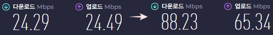
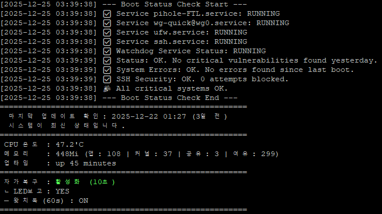
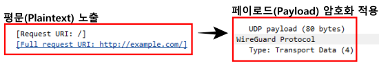
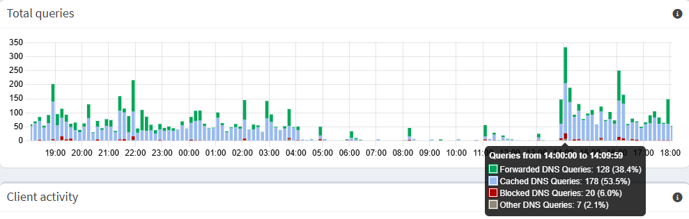
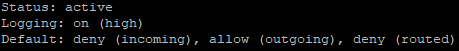
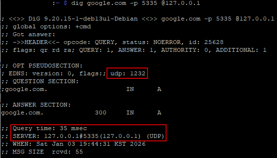
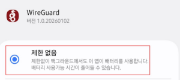

## 🚀 Simple-RpiZero2W-Security-Server
#### **자가복구형 24시간 보안 서버**
---

### 📌 Motivation & Objective
*   **배경:** 초소형/저전력 보드인 Raspberry Pi Zero 2 W의 성능 한계를 극복하고, 개인 데이터 보호를 위한 독립형 보안 서버를 구축함.
*   **목표:** 하드웨어 리소스 최적화 및 이더넷 모듈 추가를 통해 네트워크 안정성을 확보하고, 자가복구 로직 설계를 통한 24시간 무인 운영 체계 구현.

### ✅ 1. 주요 구현 및 최적화 항목 (Implementation)
제한된 시스템 자원을 효율화하고 중단 없는 24시간 운영을 위해 아래 10가지 항목을 설정하고 적용했습니다.

*   **OS Architecture:** 64-bit Lite OS 채택으로 커널 오버헤드 최소화 및 데이터 처리 효율 향상
*   **OS & System Optimization:** GUI 및 불필요한 서브시스템 제거를 통해 부팅 속도 단축 및 동작 경량화 실현
*   **GPU Memory:** 시스템 안정성과 펌웨어 호환성을 고려하여 `gpu_mem=32`로 설정 (최적 임계치 준수)
*   **Swap Control:** `dphys-swapfile` 제거로 I/O 병목 현상을 방지하고 SD 카드 하드웨어 수명 보호
*   **Interface 제어:** 전력 소모와 전파 간섭을 줄이기 위해 내장 BT/Wi-Fi 모듈을 하드웨어 수준에서 비활성화
*   **Connectivity:** `RTL8152` 기반 유선 이더넷 환경 구축으로 초소형 보드의 네트워크 안정성 한계 극복
*   **Management:** `CP2102` 시리얼 콘솔 인터페이스를 통한 하드웨어 레벨의 독립적 디버깅 경로 확보
*   **Power Efficiency:** LED/HDMI 전원 차단 설정을 통해 불필요한 하드웨어 인터럽트 및 대기 전력 소모 제거
*   **Service Tuning:** `avahi`, `triggerhappy` 등 서버 운영에 불필요한 백그라운드 데몬 프로세스 중지
*   **Log Analysis:** `journalctl` 에러 로그 상시 분석을 통해 시스템 런타임 예외 상황 발생 선제적 차단
*   **Fault Tolerance:** Watchdog 기반의 자가복구 사이클을 구축하여 시스템 정지 시 자동 복구 환경 마련

### 📊 2. 시스템 운영 및 성능 데이터 (Performance)
실제 운영 중인 서버에서 측정된 네트워크 처리량과 시스템 상태 지표입니다.

#### **[네트워크 인터페이스 확장 및 VPN 성능 결과]**
이더넷 포트가 없는 Pi Zero 2 W에 별도 모듈을 장착하고 유선 전용 환경을 구축했습니다. 측정은 **외부 클라이언트(노트북)에서 VPN(WireGuard)을 활성화한 상태**로 진행하여 실제 서비스 체감 속도를 확인했습니다.
*   **내장 Wi-Fi 기반 VPN 연결 시:** 24 Mbps (Down) / 24 Mbps (Up)
*   **이더넷 모듈 최적화 후 VPN 연결 시:** **88 Mbps (Down) / 65 Mbps (Up)** (약 240% 향상)
*   **측정 환경:** 외부 클라이언트(노트북) ↔ WireGuard VPN 터널 ↔ Raspberry Pi Zero 2 W

> **📸 [이미지 첨부: Speedtest 성능 비교 스크린샷]**
>
> 
>
> *캡션: VPN 활성화 상태에서 인터페이스 설정 전(Wi-Fi)과 후(이더넷)의 실제 전송 속도 데이터*

#### **[시스템 가용성 및 리소스 모니터링]**
24시간 상시 가동 중인 서버의 리소스 상태와 자가복구 기능 동작 현황입니다.
*   **리소스 점유:** 앱 사용량 **108Mi** 유지 (전체 448Mi 중 여유 공간 **299Mi** 확보)
*   **발열 관리:** 장시간 구동 시에도 평균 **47.2°C** 수준의 안정적인 온도 유지 확인
*   **자가복구 로직:** 패닉 발생 시 **10초 내 자동 복구** 수행 및 **Watchdog(60s)** 상시 가동 (2025-12-25 기준)

> **📸 [이미지 첨부: 실시간 시스템 모니터링 로그 스크린샷]**
>
> 
>
> *캡션: 서비스 가동 상태(Status OK), 메모리 사용 현황, 업타임 정보 기록 화면*

### 🛡️ 3. 보안 및 견고성 (Security & Robustness)
침입 방지, 트래픽 정제, 데이터 암호화를 위해 다층 보안 구조를 설계했습니다.

#### **[보안 1] WireGuard를 통한 데이터 기밀성 확보**
외부 네트워크에서도 안전하게 서버에 접속할 수 있도록 VPN 터널링을 구축했습니다.
*   **검증 내역:** Wireshark 패킷 분석을 통해 VPN 적용 전(HTTP 평문 노출)과 후(페이로드 암호화)를 명확히 대비하여 데이터 기밀성이 확보되었음을 시각적으로 검증했습니다. (이미지와 연계)

> **📸 [이미지 첨부: Wireshark 패킷 비교 스크린샷]**
>
> 
>
> *캡션: VPN 적용 전(평문)과 후(암호화)의 데이터 패킷 구조 분석 결과*

#### **[보안 2] Pi-hole 기반 트래픽 정제 및 분석**
네트워크 레벨에서 불필요한 도메인 요청을 제어하여 트래픽 효율성을 높였습니다.

운영 내역
* **시스템 가동 및 장기 모니터링**: 서버 구축 후 17:00부터 익일 18:00까지(약 25시간) 연속 가동하며 트래픽 추이를 분석했습니다.
* **트래픽 패턴 파악**: 관측 기간 중 14:00 시간대에 일일 최대 쿼리(Peak)가 발생했음을 확인하였으며, 전 기간에 걸쳐 자원 과부하 없이 안정적으로 쿼리를 처리했습니다.
* **유해 트래픽 선제적 차단**: 전체 쿼리 중 6.0%에 달하는 불필요/악성 도메인 요청(Blocked DNS Queries)을 네트워크 단에서 차단하여 보안을 강화했습니다.
* **DNS 응답 속도 향상**: 전체 쿼리의 53.5%를 내부 캐시(Cached DNS Queries)로 처리하여 불필요한 외부 통신을 줄이고 응답 속도를 높였습니다.

> **📸 [이미지 첨부: Pi-hole Total Queries 그래프 스크린샷]**
>
> 
>
> *캡션: 실시간 DNS 쿼리 처리 현황을 나타내는 Pi-hole 통계 그래프*

#### **[보안 3] UFW 방화벽 정책 및 침입 차단**
인가된 서비스 포트 외의 모든 접근을 원천 차단하기 위해 'Default Deny' 정책을 수립했습니다.
*   **설정 내역:** 인가된 서비스 포트(예: SSH 포트) 외 모든 접근을 'Default Deny' 정책으로 원천 차단했습니다.
검증 성과: 시스템 운영 기간 동안 실시간 로깅(logging high)을 수행한 결과, 단 한 건의 비인가 접속 시도도 발생하지 않았습니다.

> **📸 [이미지 첨부: UFW 설정 현황(status verbose) 스크린샷]**
>
>
>
> *캡션: 기본 차단(Deny) 정책이 적용된 방화벽 운영 상태*

#### **[보안 4] Unbound 기반 로컬 재귀 리졸버 구축**
외부 DNS(Google, Cloudflare 등)에 대한 의존도를 제거하고, 로컬 재귀 리졸버(Recursive Resolver)를 구축하여 DNS 하이재킹 원천 차단 및 사용자 프라이버시 완결성을 확보했습니다.

*   **독립적 주권 확보:** 루트 네임서버부터 직접 반복 질의(Recursive Query)를 수행하여 외부 DNS 업체의 필터링이나 로그 기록 가능성을 배제했습니다.
*   **DNSSEC 보안 검증:** 로컬에서 직접 DNS 보안 서명을 검증하여 응답 데이터의 위변조 여부를 물리적으로 확인합니다.
*   **프라이버시 강화:** 업스트림 서버에 쿼리 로그를 남기지 않음으로써 네트워크 활동 메타데이터의 외부 유출을 원천 차단했습니다.

> **📸 [이미지 첨부: local DNS 구축현황(status verbose) 스크린샷]**
>
> 
>
> *캡션: Unbound 재귀 리졸버 가동 상태 및 DNSSEC 검증을 통한 쿼리 무결성 확인 화면*

---

### 💡 4. 주요 분석 사례 (Engineer's Insights)
*   **하드웨어 확장 대응:** 이더넷 포트가 없는 환경에서 모듈 추가 및 인터페이스 설정을 통해 유선 네트워크의 신뢰성을 확보함.
*   **시스템 정합성 유지:** 최저 메모리 할당 시 발생하는 시스템 오류를 방지하기 위해 `gpu_mem` 값을 최적 임계치(32MB)로 조정하여 안정성 확보.
*   **지속 가용성 확보:** 자가복구 로직과 시각적 보고(LED) 체계를 결합하여 별도 관리자가 없는 환경에서도 스스로 동작하는 서버 가용성 구현.

#### **🛠️ Troubleshooting Log**

#### **VPN 수신 단절(Black-hole)**
*   **발생 일자:** 2026년 1월 3일
*   **현상 (Issue):**
    *   WireGuard VPN 연결은 성공했으나, 외부 환경(특히 모바일 네트워크)에서 접속 시 수신(Inbound) 트래픽이 완전히 0으로 고정되는 블랙홀(Black-hole) 현상 포착.
    *   서비스 멈춤(Stall) 또는 접속 끊김 발생.
*   **분석 (Analysis):**
    *   표준 이더넷 MTU(**1500**바이트) 환경에서 WireGuard의 암호화 오버헤드(약 80바이트)와 통신사별 상이한 캡슐화(Encapsulation) 방식이 중첩됨.
    *   최종 패킷 크기가 네트워크 경로상의 임계치를 초과하여 패킷 단편화(Fragmentation)가 발생했고, 일부 장비에서 단편화된 패킷을 유실(Drop)시키는 현상 확인.
*   **해결 (Solution):**
    *   VPN 터널의 MTU 값을 1420에서 1280으로 하향 조정하여 재설정.
    * 다양한 환경에서의 최적값 탐색 대신, IPv6 최소 규격(RFC 2460)인 1280을 채택하여 모든 모바일 인프라에서 패킷 손실 없이 동작하는 '글로벌 가용성(Global Availability)' 확보.
    * 서버는 유선 환경의 효율을 위해 MTU 1500을 유지하고, 클라이언트 외부접속 기기에만 1280을 조건부 적용하여 '최대 성능'과 '글로벌 가용성'이라는 두 마리 토끼를 잡는 하이브리드 전략 채택.
*   **결과 (Result):**
    *   네트워크 환경(유선/Wi-Fi/LTE)에 관계없이 일관되고 안정적인 VPN 연결성 확보.
    *   불필요한 패킷 재전송(Retransmission) 오버헤드 감소 및 서비스 신뢰성 향상.
    

#### **안드로이드 절전 정책(Doze Mode)에 따른 VPN 접속 지연 분석**
*   **발생 일자:** 2026년 1월 10일
*   **현상 (Issue):**
    *   배터리 15% 이하 저전력 상태에서 장시간(10시간 이상) 유휴 후 VPN 접속 시도 시 약 25~30초간 연결 지연 발생.
    *   로그 확인 결과 sendmsg: network is unreachable 에러가 반복되며 핸드셰이크(Handshake) 수립 불가.

*   **분석 (Analysis):**
    *   시스템 요인: 안드로이드 Doze 모드(강력 절전) 진입 시, 시스템이 백그라운드 통신을 제한하고 통신 모뎀(LTE/5G) 전원 공급을 차단하여 발생. 기기를 깨운 직후에도 OS가 모뎀 인터페이스를 활성화하기 전까지 패킷 전송이 불가능한 'White-out' 구간 포착.
    *   네트워크 요인: 장시간 유휴 상태로 인해 통신사(Carrier) 게이트웨이에서 유지하던 UDP 세션이 만료되어 경로가 회수된 상태임을 타임스탬프 기반 로그 분석으로 입증.

*   **해결 (Solution):**
    *   OS 최적화: 해당 앱의 배터리 최적화 설정을 **[제한 없음]** 으로 변경하여 백그라운드 통신 우선순위 확보.
    > **📸 [이미지 첨부: WireGuard 앱의 배터리 사용량 관리 설정 스크린샷]**
    >
    > 
    >
    > *캡션: WireGuard 앱 배터리 최적화 '제한 없음' 설정 화면*

    *   세션 유지 전략: 통신사 NAT 세션 만료 시간(보통 30~60초)을 고려하여 와이어가드 설정에 PersistentKeepalive = 25 옵션 추가 검토. (환경에 따른 조건부 적용)

*   **결과 (Result):**
    *   유휴 상태 이후에도 즉각적인 VPN 핸드셰이크 수립 성공 및 network is unreachable 예외 상황 제거.
    *   스마트폰 전원 관리 정책과 VPN 프로토콜 간의 상호작용에 대한 데이터 기반의 대응력 확보.
---

### 🛠 Tech Stack
**WireGuard | Pi-hole | Linux Kernel Tuning | Shell Scripting | UFW | Unbound | DNS over TLS | Watchdog | Wireshark**

---

Copyright 2025. **TheSimplist-KOR** all rights reserved.